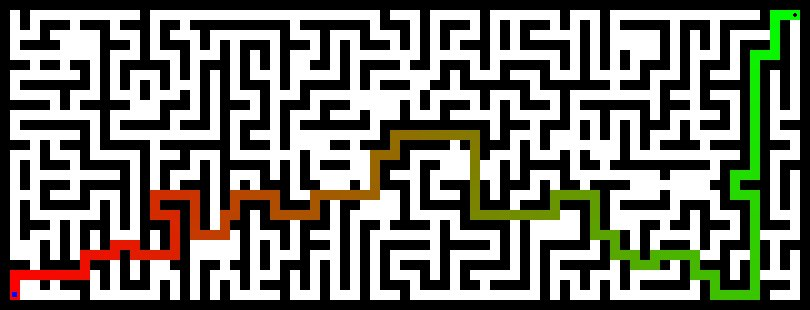

# CS 440 MP1: Search

## Introduction 
This is an program for searching shortest part for any maze with one or more goals. BFS, DFS, Astar, and related data structures (priority queue, disjoint sets) are implemented. 

#### Example:
- Single Goal:
  


  
- Multiple Goals:


## Requirements:
```
python3
pygame
```
## Running:
The main file to run the mp is mp1.py:

```
usage: mp1.py [-h] [--method {bfs,dfs,greedy,astar}] [--scale SCALE]
              [--fps FPS] [--human] [--save SAVE]
              filename
```

Examples of how to run MP1:
```
python mp1.py bigMaze.txt --method dfs
```
```
python mp1.py tinySearch.txt --scale 30 --fps 10 --human
```

For help run:
```
python mp1.py -h
```
Help Output:
```
CS440 MP1 Search

positional arguments:
  filename              path to maze file [REQUIRED]

optional arguments:
  -h, --help            show this help message and exit
  --method {bfs,dfs,greedy,astar}
                        search method - default bfs
  --scale SCALE         scale - default: 20
  --fps FPS             fps for the display - default 30
  --human               flag for human playable - default False
  --save SAVE           save output to image file - default not saved
```
